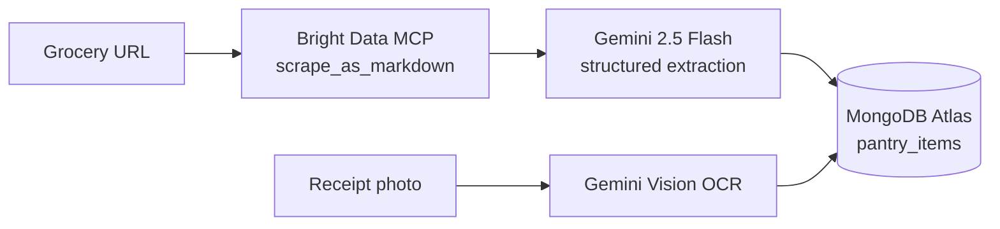
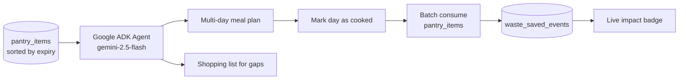

# PantryPilot


Zero-effort food waste reduction. Import grocery purchases from any retailer via Bright Data MCP, scan receipts with Gemini Vision, and let an AI agent generate meal plans that use near-expiry items first — backed by MongoDB Atlas through the official MongoDB MCP server.

Partner integrations: **MongoDB**, **Bright Data**.

---

## Workflows

### Import items into the pantry



### Plan meals and track waste



---

## Quick start

```bash
git clone <repo> && cd pantrpilot
cp .env.example .env                # fill in required keys
uv sync                             # install Python deps
uv run scripts/seed_db.py           # seed MongoDB fixtures
bash scripts/start.sh               # start MCP sidecar + FastAPI
```

Open `http://localhost:8000`. Smoke check: `bash scripts/smoke.sh`.

**Requirements:** Python 3.13, Node.js 20+, [uv](https://astral.sh/uv/), a MongoDB Atlas M0 cluster, and a Google AI Studio key.

---

## Configuration & integrations

Configuration lives in `.env`. Required: `GOOGLE_API_KEY` (Gemini Vision + ADK) and `MDB_MCP_CONNECTION_STRING` (Atlas). Optional: `BRIGHTDATA_API_TOKEN` (5,000 free scrapes/month — enables URL import), `MDB_TLS_ALLOW_INVALID_CERTS=true` (corporate networks with TLS inspection), `MCP_TRANSPORT` (`http` default or `stdio`), `PORT` (default `8000`). Two MCP servers run as sidecars: `mongodb-mcp-server` exposes Atlas to the ADK agent, and `@brightdata/mcp` powers cross-retailer URL scraping.
