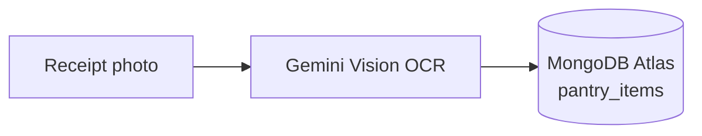
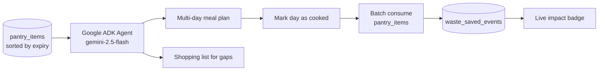
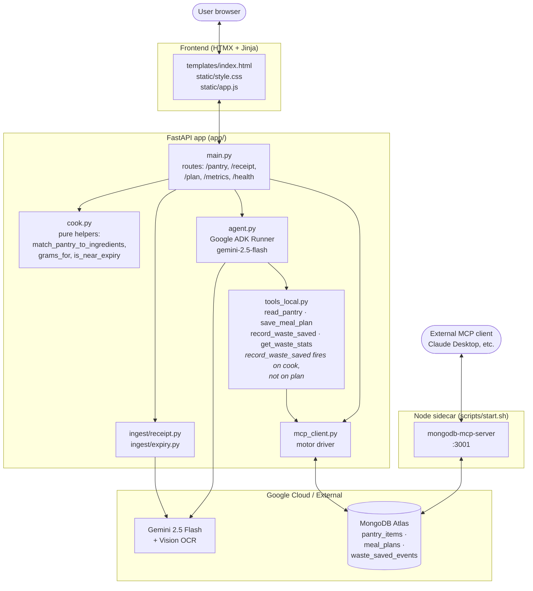

# PantryPilot


> **Google Cloud Rapid Agent Hackathon submission — MongoDB partner track.**
> A multi-step Gemini agent, built with the **Google Agent Development Kit
> (ADK / Agent Builder)** and grounded in **MongoDB Atlas via the official
> [`mongodb-mcp-server`](https://github.com/mongodb-js/mongodb-mcp-server)**,
> that plans meals to use up near-expiry groceries before they go to waste.

Zero-effort food waste reduction. Scan grocery receipts with Gemini Vision
and let an ADK agent generate meal plans that use near-expiry items first —
backed by MongoDB Atlas through the official MongoDB MCP server.

**Partner integration (judged track):** MongoDB MCP.

---

## Workflows

### Import items into the pantry



### Plan meals and track waste



---

## Quick start

```bash
git clone <repo> && cd pantrpilot
cp .env.example .env                # fill in required keys
uv sync                             # install Python deps
uv run scripts/seed_db.py           # seed MongoDB fixtures
bash scripts/start.sh               # start MCP sidecar + FastAPI
```

Open `http://localhost:8000`. Smoke check: `bash scripts/smoke.sh`
(set `SMOKE_PLAN=1` to also exercise the agent end-to-end).

**Requirements:** Python 3.13, Node.js 20+, [uv](https://astral.sh/uv/), a MongoDB Atlas M0 cluster, and a Google AI Studio key.

---

## Architecture



* **Agent runtime — Google ADK (Agent Builder).** [`app/agent.py`](app/agent.py)
  builds a `gemini-2.5-flash` `Agent` with three `FunctionTool`s
  (`read_pantry`, `save_meal_plan`, `get_waste_stats`).
  The system prompt forces a multi-step plan: read pantry → prioritise items
  expiring ≤5 days → draft N-day menu → persist plan → project the waste
  that *would* be rescued. Actual waste-saved events are only written when
  the user marks a day as cooked, so the impact badge reflects food that was
  really eaten. Each `POST /plan` spins up a fresh `Runner` so there's no
  cross-request session state.
* **MongoDB MCP integration.** The official `mongodb-mcp-server` is launched
  as a sidecar on `:3001` by [`scripts/start.sh`](scripts/start.sh) and is
  the partner-MCP surface for this submission — any MCP-aware client
  (Claude Desktop, an external ADK agent, etc.) can connect and read/write
  Atlas through it. The FastAPI process also talks to the **same Atlas
  cluster** directly via `motor` ([`app/mcp_client.py`](app/mcp_client.py))
  to keep the HTMX-driven UI snappy without a JSON-RPC hop on every render.
  The data layer keeps the original `mcp_*` function names so transports
  are interchangeable.

---

## Deploy to Google Cloud Run

The repo ships a [`Dockerfile`](Dockerfile) that bundles Python 3.13, Node 20
(for the two MCP sidecars), and `uv`. One-shot deploy:

```bash
PROJECT_ID=your-gcp-project
REGION=us-central1

gcloud run deploy pantrpilot \
  --source . \
  --region $REGION \
  --allow-unauthenticated \
  --memory 1Gi --cpu 1 --timeout 300 \
  --set-env-vars "GOOGLE_API_KEY=...,MDB_MCP_CONNECTION_STRING=..."

## Demo script (≈3 min)

1. **Setup (15 s)** — Hit `POST /pantry/reset` to seed five items, two of
   them expiring in 1–2 days. Show the pantry table colour-coding urgent vs.
   safe items.
2. **Ingest superpower (45 s)** — Drop a receipt image on the upload zone
   → Gemini Vision OCR returns structured items → expiry estimator fills in
   shelf-life → rows stream in via HTMX.
3. **Agent in action (90 s)** — Click **Generate Plan**. Narrate the
   multi-step trace: the ADK agent calls `read_pantry`, picks the
   spinach + chicken expiring this week, drafts a 3-day menu, writes the
   plan and waste-saved events back to Atlas. Highlight the shopping list
   for gaps.
4. **Close the loop (30 s)** — Click **Mark day as cooked**. The pantry
   shrinks, the live impact badge ticks up (`lbs saved`, `items rescued`).
   That's the agent finishing the job, not just answering a question.

---

## Configuration & integrations

Configuration lives in `.env`. Required: `GOOGLE_API_KEY` (Gemini Vision + ADK) and `MDB_MCP_CONNECTION_STRING` (Atlas). Optional: `MDB_TLS_ALLOW_INVALID_CERTS=true` (corporate networks with TLS inspection), `MCP_TRANSPORT` (`http` default or `stdio`), `PORT` (default `8000`). The `mongodb-mcp-server` sidecar exposes Atlas to external MCP clients.
